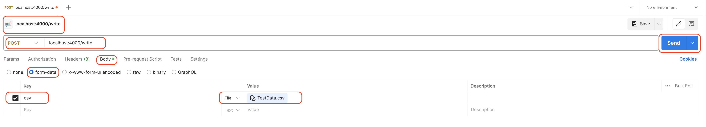
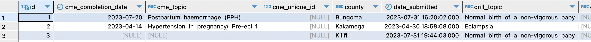

# JC-Assignment

----
## API

### Dependencies
The application utilizes the following libraries:

- Flask: Web framework for building web applications.
- Flask-SQLAlchemy: SQLAlchemy integration for Flask.
- SQLAlchemy: For object-relational mapping.
- pandas: For reading the 'Test CSV' file
- numpy: For converting items to integers.
- helpers: Custom Python module for CSV file handling functions.


### Database Model
The application utilizes a SQLAlchemy model named MentorChecklist to represent checklist entries. The model has the following fields:

    id: Primary key (integer)
    cme_completion_date: Date of CME completion (date)
    cme_topic: Topic of CME (text)
    cme_unique_id: Unique identifier for CME (bigint)
    county: County (text)
    date_submitted: Date of checklist submission (timestamp)
    drill_topic: Topic of drill (text)
    drill_unique_id: Unique identifier for drill (text)
    essential_cme_topic: Boolean flag indicating if CME topic is essential
    essential_drill_topic: Boolean flag indicating if drill topic is essential
    facility_code: Facility code (text)
    facility_name: Facility name (text)
    id_number_cme: ID number for CME (text)
    id_number_drill: ID number for drill (text)
    mentor_name: Mentor name (text)
    submission_id: Submission ID (bigint)
    success_story: Success story (text)

### API Endpoints
The application defines two API endpoints:
#### 1. /write (POST)

- This endpoint accepts a CSV file containing MentorChecklist data.
- The request method must be POST.
- The CSV file should be uploaded using the csv key in the request form.
- The **helpers** module contains functions for processing the CSV data (read_cases and create_case_combined).
The is an alternative create csa function 'create_case_combined', that creates single row case items however this will result in NULL values in some cells in the DB
    - For each valid case in the CSV, a new Mentor Checklist entry is created in the database.
    - Upon successful data loading, a response is returned with a success message.
    - Any error encountered during CSV processing results in an error response with details.
- If no CSV file is found or no cases are identified in the CSV, an error is returned with an appropriate message.


#### 2. / (GET)

- This is the default endpoint that returns a response with a message indicating the container is running and to use the /write endpoint for CSV processing.

### Running the Application

- Ensure all required dependencies are installed (flask, flask-sqlalchemy, sqlalchemy, pandas, numpy). ```pip install -r requirements.txt```
- Set the DB_URL environment variable to your database connection string.
- Run the application using: 
    - ```python app.py``` then access via the provided URL.
    - OR ``` docker compose up flask_app ``` then access via ```localhost:4000```

-----
## Helper functions

- Process and transform data for loading into the MentorChecklist db.
- Handle missing values and inconsistencies in the input data.


1. **read_cases()**
- Splits a DataFrame into individual cases, where each row represents a case.
- Returns: A list of DataFrames, where each DataFrame contains a single case.

2. **create_cases_combined()**
- Processes a single case DataFrame for loading into the database.
- Tasks:
    - Drops empty columns. (From 92 to around 31 - 35). This was done to make it easier to extract Facility Details
    - Extracts facility code and name from a combined column.
    - Maps common data to cells for loading.
    - Maps unique data to cells based on presence.
    - Handles missing values.
    - Returns: A list of dictionaries, where each dictionary represents a row to be inserted into the database.
    - Dictionry 

3. **cme()**
```python
def cme(row):
    cme_col = "mentor_checklist/cme_grp/cme_topics"
    cme_id =  "mentor_checklist/cme_grp/standard_phone_numbers_cme/id_number_1_001"

    if row.get(cme_col, None) is not None:
        return row.get(cme_col, None), int(row.get(cme_id, None)), False
    else:
        return None, None, True
```
- Extracts CME-related information from a row of data.
- Returns:
    - CME topic (str)
    - CME unique ID (int)
    - Boolean flag indicating if CME topic is essential


4. **drill()**
```python
def drill(row):
    drill_col = "mentor_checklist/drills_grp/drill_topics"
    drill_id =  "mentor_checklist/drills_grp/id_numbers_drill/id_drill_1"

    if row.get(drill_col, None) is not None:
        return row.get(drill_col, None), int(row.get(drill_id, None)), False
    else:
        return None, None, True
```
- Extracts CME-related information from a row of data.
- Returns:
    - CME topic (str)
    - CME unique ID (int)
    - Boolean flag indicating if CME topic is essential

--- 

## Testing

### Prerequisites:

- Postman
- API Base URL: http://localhost:4000
----

## Testing the /write Endpoint

- Create a POST Request
- Set endpoint to: http://localhost:4000/write
- Add CSV File: In the request body and also set the key to **csv**.
- Send Request

<br>


##### Expected Response:

```json 
{
    "message": "Data loaded well"
}
```
- Upon successful data upload, a response code of 201 Created will be returned. wiith the message <br>

- Upon Checking the DB, the fetched data should be visible in the meteor checklist table

<br>




----

### Testing Error Scenarios:

1. **An empty request without a CSV file.**

```json
{
    "details": "No columns to parse from file",
    "error": "Error reading provided CSV file"
}
```
- The response code should indicate an error with messgae indicating missing columns to parse

2. **Duplicate Keys**
```json
{
    "details": ""details": "(psycopg2.errors.UniqueViolation) duplicate key value violates......",
    "error": "Error reading provided CSV file"
}
```
- The response code should indicate an error flagging duplicate a key

----

## Testing the / (GET) Endpoint

- Create a GET Request
- Set endpoint to: http://localhost:4000/
- Send Request

##### Expected Response:

```json 
{
    "message": "Container Running, use /write for csv test"
}
```

- The response body will likely contain a message indicating the container is running and to use the /write endpoint for CSV processing.